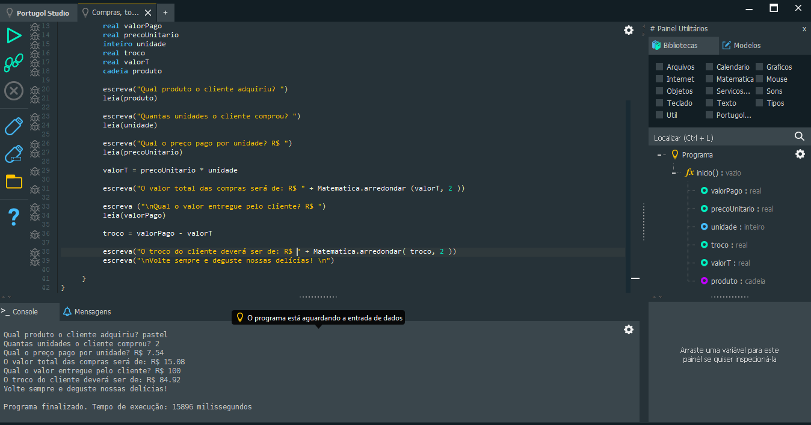

# 📚 Estudos de Portugol (sangaletti35-ops)

Este repositório contém meus exercícios e projetos práticos desenvolvidos em Portugol para fins de estudo. O objetivo é acompanhar minha evolução ao longo do tempo.

---

## 🛍️ Projeto 1: Cálculo de Compras e Troco (Fruteira)

**Objetivo:** Criar um programa para calcular o valor total de compras e o troco para o cliente, focado na clareza do código e boas práticas de nomenclatura.

* **💻 Ver o Código:** [Clique aqui para abrir o arquivo de código (.por)](./Projeto-Fruteira/sistema_caixa.por)
* **📸 Demonstração em Execução:**

### ✅ Funcionalidades Implementadas
* Entrada de nome do produto, quantidade e preço unitário.
* Cálculo do valor total e valor do troco.
* Utilização da biblioteca `Matematica` para arredondamento (2 casas decimais).
* Nomenclatura de variáveis clara (ex: `precoUnitario`, `valorPago`).

---

## 💧 Projeto 2: Cálculo de Volume de Água

**Objetivo:** Desenvolver um algoritmo com lógica sequencial para calcular o volume exato (em metros cúbicos) necessário para encher um tanque, a partir de suas dimensões geométricas.

* **💻 Ver o Código:** [Clique aqui para abrir o arquivo de código (.por)](./cálculo%20de%20volume/Volume%20de%20água%20para%20encher%20tanque.por)
* **📸 Demonstração em Execução:**

### ✅ Funcionalidades Implementadas
* Solicita as três medidas essenciais do tanque (Largura, Comprimento e Profundidade).
* Realiza a multiplicação sequencial das variáveis.
* Exibe o resultado final de forma direta no console.
