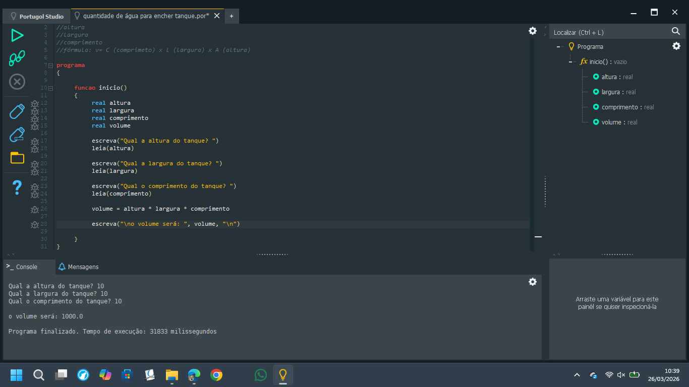

<div align="center">

<!-- ═══════════════════════════════════════════════════════════ -->
<!--                     BANNER PRINCIPAL                       -->
<!-- ═══════════════════════════════════════════════════════════ -->


<br>

# 💧 Cálculo de Volume de Água para Encher Tanque

<p>
  
  
  
  
</p>

<p>
  
  
  
</p>

<br>

> *"Toda grande jornada começa com um único passo — ou, no caso da programação, com uma única variável."*

</div>

---

## 🗺️ Sobre o Projeto

Este é um programa **simples e intencional**. Não foi pensado para resolver problemas complexos — foi pensado para **dar o primeiro passo**.

Desenvolvido durante o curso de **Lógica de Programação** no **SESI SENAI de Concórdia/SC**, este projeto marca o início da minha trajetória no desenvolvimento de sistemas. Cada linha de código aqui representa um conceito aprendido: declaração de variáveis, entrada de dados, operações matemáticas e saída formatada.

O programa calcula o **volume de água necessário para encher um tanque retangular** a partir das três dimensões fornecidas pelo usuário (altura, largura e comprimento), utilizando a fórmula:

<div align="center">

```
V = Comprimento × Largura × Altura
```

</div>

---

## 🖥️ Demonstração

<div align="center">



<sub>▲ Programa em execução no Portugol Studio — entrada de dimensões e exibição do volume calculado.</sub>

</div>

---

## 📁 Estrutura do Repositório

```
📂 cálculo de volume/
├── 📄 quantidade de água para encher tanque.por   ← código-fonte principal
└── 🖼️  amostra.png                                 ← demonstração em execução
```

---

## 🔍 Entendendo o Código

```portugol
programa
{
    funcao inicio()
    {
        real altura
        real largura
        real comprimento
        real volume

        escreva("Qual a altura do tanque? ")
        leia(altura)

        escreva("Qual a largura do tanque? ")
        leia(largura)

        escreva("Qual o comprimento do tanque? ")
        leia(comprimento)

        volume = altura * largura * comprimento

        escreva("\no volume será: ", volume, "\n")
    }
}
```

| Conceito aplicado | Descrição |
|---|---|
| `real` | Tipo de dado para números decimais |
| `escreva()` | Saída de texto para o usuário |
| `leia()` | Entrada de dados pelo teclado |
| `*` | Operador de multiplicação |
| `\n` | Quebra de linha na saída |

---

## 🎯 Objetivo deste Portfólio

Este repositório **não é sobre complexidade** — é sobre **evolução documentada**.

Cada projeto aqui representa uma etapa do meu aprendizado no curso técnico em **Desenvolvimento de Sistemas** pelo SESI SENAI Concórdia. Ao longo do curso, os projetos ficarão progressivamente mais elaborados, refletindo o crescimento em:

- 📐 **Lógica de programação** (Portugol → linguagens reais)
- 🌐 **Desenvolvimento web** (HTML · CSS · JavaScript)
- 🗄️ **Banco de dados** (SQL)
- 🔧 **Ferramentas profissionais** (Git · GitHub · VS Code)

> Se você é um recrutador ou colega visitando este repositório: obrigado pelo interesse. Estou no início da caminhada — e comprometido com ela. 🚀

---

## ⬇️ Como Baixar e Executar o Programa

### Pré-requisitos

Você precisará do **Portugol Studio** instalado na sua máquina.

> 📥 Download gratuito em: **[http://lite.acad.univali.br/portugol/](http://lite.acad.univali.br/portugol/)**

---

### Passo a Passo

**1. Clone ou baixe o repositório**

```bash
# Via Git (recomendado):
git clone https://github.com/sangaletti35-ops/Estudos-Portugol.git
```

> Ou clique em **`Code → Download ZIP`** no topo da página do repositório e extraia o arquivo.

---

**2. Navegue até a pasta do projeto**

```
📂 Estudos-Portugol/
└── 📂 cálculo de volume/
    └── 📄 quantidade de água para encher tanque.por   ← este arquivo
```

---

**3. Abra o Portugol Studio**

Após a instalação, abra o programa. Você verá uma janela com editor de código e área de execução.

---

**4. Abra o arquivo `.por`**

- No menu superior, clique em **`Arquivo → Abrir`**
- Localize o arquivo `quantidade de água para encher tanque.por`
- Clique em **Abrir**

---

**5. Execute o programa**

- Clique no botão ▶️ **Executar** (ou pressione `F6`)
- No console que aparecer, informe os valores pedidos:
  - Altura do tanque (ex: `2.5`)
  - Largura do tanque (ex: `3.0`)
  - Comprimento do tanque (ex: `4.0`)
- O programa exibirá o **volume calculado** em metros cúbicos

---

**6. Exemplo de execução**

```
Qual a altura do tanque? 2.5
Qual a largura do tanque? 3.0
Qual o comprimento do tanque? 4.0

o volume será: 30.0
```

---

## 👤 Autor

<div align="center">

**Maurício Sangaletti**
Estudante de Desenvolvimento de Sistemas · SESI SENAI Concórdia/SC

<br>

[](https://github.com/sangaletti35-ops)

</div>

---

<div align="center">

<sub>Feito com 💧 e muita lógica · SESI SENAI Concórdia · 2025–2026</sub>

</div>
